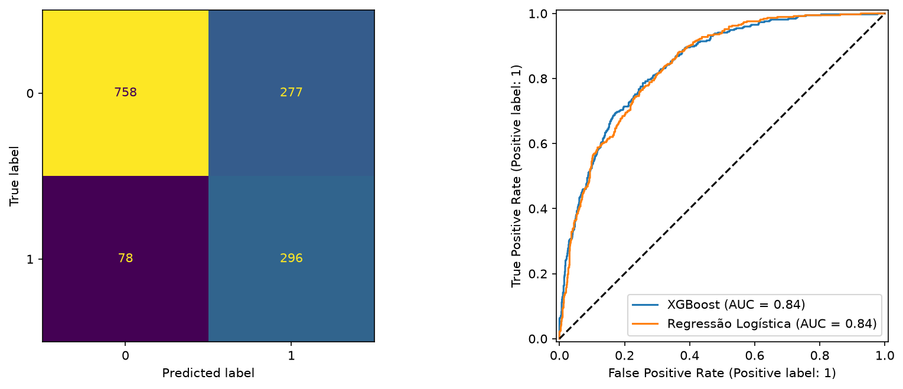
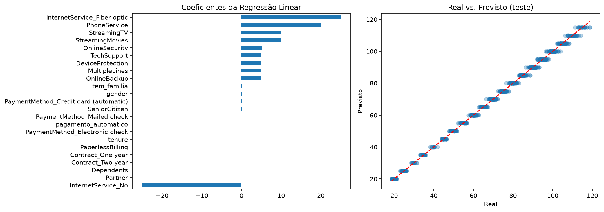
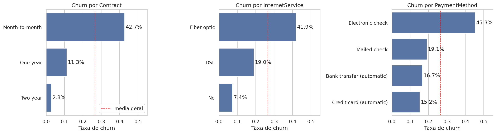
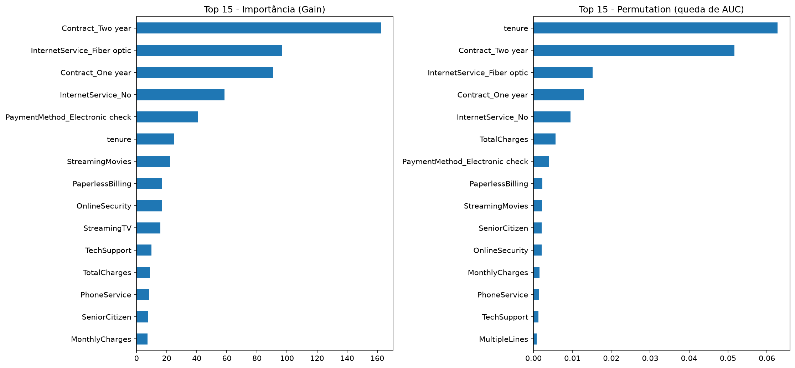

# 📊 Telco Customer Churn & Pricing Analysis

**Prevendo o cancelamento de clientes e validando a consistência de precificação com Machine Learning.**


## 🎯 Resumo do projeto

Usando dados de uma operadora de telecomunicações (**7.043 clientes**, 21 colunas), o projeto resolve dois problemas de negócio com algoritmos diferentes:

| Problema | Tipo | Algoritmo | Alvo |
|---|---|---|---|
| Consistência de precificação | Regressão | Regressão Linear | `MonthlyCharges` |
| Retenção de clientes | Classificação binária | XGBoost | `Churn` (26,5% positivos) |

O objetivo não é apenas "rodar algoritmos", mas extrair **insights acionáveis** que reduzam a perda de clientes e identifiquem inconsistências de faturamento.

## 📈 Resultados

### Classificação: prever `Churn` (conjunto de teste, 1.409 clientes)

| Modelo | AUC-ROC (teste) | AUC-ROC (CV 5-fold) | Precision (churn) | Recall (churn) | F1 (churn) |
|---|---|---|---|---|---|
| **XGBoost** | **0,845** | 0,846 ± 0,011 | 0,52 | 0,79 | 0,63 |
| Regressão Logística (baseline) | 0,842 | 0,845 ± 0,013 | 0,51 | 0,79 | 0,62 |

- O desbalanceamento (~2,77 não-churn para cada churn) é tratado com `scale_pos_weight`.
- A validação cruzada é feita com `Pipeline`, de modo que o pré-processamento é ajustado dentro de cada fold, sem vazamento.
- **Leitura honesta:** o XGBoost **empata** com a Regressão Logística neste dataset. O sinal está em poucas variáveis com relações quase lineares (contrato, tempo de casa, internet), então um modelo mais complexo não traz ganho mensurável. O XGBoost fica como demonstração da técnica e fonte de importâncias de variável.
- O limiar de decisão é 0,5 (recall alto, precision moderada). Em produção, o limiar deve ser definido pelo custo da ação de retenção versus o valor do cliente retido.



### Regressão: prever `MonthlyCharges` (conjunto de teste)

| Modelo | MAE | RMSE | R² |
|---|---|---|---|
| **Regressão Linear** | **0,79** | **1,05** | **0,999** |
| Baseline (média) | 26,03 | 30,09 | 0,000 |

R² em 5-fold CV: 0,999.



**Como ler este resultado:** a mensalidade da Telco é praticamente **aditiva**: cada serviço soma um valor quase fixo. Os coeficientes recuperam essa tabela de preços (Fibra ótica ≈ +US$ 25; telefonia ≈ +20; cada streaming ≈ +10; segurança, backup, proteção de dispositivo, suporte e múltiplas linhas ≈ +5 cada). O R² próximo de 1 significa que o modelo **redescobre a tabela de preços**, e não que prevê algo difícil. O valor prático está nos **resíduos**: clientes com cobrança muito diferente da prevista são candidatos a auditoria de faturamento ou a revisão de desconto.

## 🔍 Insights de negócio

Baseados na [análise exploratória](notebooks/01_eda.ipynb) e na importância de variáveis do XGBoost.



1. **O tipo de contrato é a principal alavanca de retenção.** Churn de **42,7%** no plano mensal, **11,3%** no anual e **2,8%** no bienal. Migrar clientes mensais para contratos longos (com desconto ou benefício) é a ação de maior retorno potencial.
2. **O risco se concentra no primeiro ano.** Churn de **47,4%** entre 0-12 meses de casa, contra **9,5%** após 49 meses. Os 10 clientes de maior risco no teste têm entre 1 e 7 meses de casa, todos em contrato mensal, o que justifica um programa de onboarding ativo nos primeiros 90 dias.
3. **Fibra ótica e cheque eletrônico merecem investigação.** Churn de 41,9% na fibra (DSL: 19,0%) e de 45,3% no cheque eletrônico (pagamento automático: 16,0%). O modelo indica *onde* olhar (qualidade, suporte, preço, atrito de pagamento), mas não a causa.
4. **Serviços adicionais se associam a menos churn.** Entre clientes com internet, o churn cai de 52% (nenhum serviço adicional) para 5% (os seis). Pode haver efeito de engajamento, então não é prova de que "vender mais serviços retém".
5. **Priorizar por valor.** Combinar `prob_churn × MonthlyCharges` ordena a fila de retenção por receita em risco, e não só por probabilidade.



As variáveis mais importantes são `tenure`, `Contract` (2 anos e 1 ano), `InternetService` (fibra ótica) e `TotalCharges`, consistentes com a EDA.

## ⚠️ Limitações

- **Associação não é causalidade.** Importância de variável e taxas por segmento indicam correlação. Antes de afirmar que "um desconto no contrato reduz o churn", seria necessário um teste A/B.
- **Variáveis correlacionadas dividem importância.** `tenure`, `TotalCharges` e `Contract` são relacionadas, então o ranking individual da *permutation importance* subestima cada uma. Por isso o projeto mostra *gain* e *permutation* lado a lado.
- **R² ≈ 0,999 na regressão reflete a precificação aditiva** do dataset, e não uma dificuldade resolvida por ML. `TotalCharges` e `n_servicos_internet` foram excluídas da regressão para evitar vazamento e colinearidade.
- **Sem dados comportamentais.** Sem uso da rede, chamados de suporte ou atrasos de pagamento, o teto de AUC do dataset gira em torno de 0,85, e não há ganho garantido com modelos mais complexos.
- **Limiar fixo em 0,5.** Não foi otimizado por custo de negócio.
- **Dataset estático** de ~7 mil clientes: não captura sazonalidade nem mudanças de comportamento ao longo do tempo.

## 🗂️ Estrutura do projeto

```
ML/
├── data/raw/                 # CSV original (imutável)
├── notebooks/
│   └── 01_eda.ipynb          # análise exploratória (executado)
├── src/
│   ├── config.py             # caminhos, seed, listas de colunas
│   ├── data.py               # carga e limpeza
│   ├── features.py           # pré-processamento (One-Hot, escala)
│   ├── regression.py         # Regressão Linear
│   ├── classification.py     # XGBoost + baseline logístico
│   ├── interpretability.py   # importâncias, churn por segmento, lista de risco
│   └── evaluation.py         # salvar figuras e métricas
├── scripts/                  # pontos de entrada
├── tests/                    # 18 testes (dados, features, pipeline)
├── models/                   # modelos treinados (.joblib, ignorados pelo Git)
├── reports/
│   ├── figures/              # gráficos usados neste README
│   └── metrics.json          # métricas da última execução
└── main.py                   # roda regressão + classificação
```

## 🚀 Como rodar

```bash
# 1. Ambiente virtual
python -m venv .venv
# Windows (PowerShell): .\.venv\Scripts\Activate.ps1
# Linux/macOS:          source .venv/bin/activate

# 2. Dependências
pip install -r requirements-dev.txt

# 3. Pipeline completo (gera modelos, figuras e reports/metrics.json)
python main.py

# Ou etapa por etapa (sempre da raiz do projeto)
python -m scripts.train_regression
python -m scripts.train_classification

# 4. Testes e estilo
pytest
ruff check .
```

A EDA pode ser reexecutada abrindo `notebooks/01_eda.ipynb` no Jupyter ou no VS Code.

## 🧪 Qualidade de código

- Código modular com PEP 8, verificado pelo `ruff`.
- **Pipelines do scikit-learn** impedem vazamento de dados entre treino e teste.
- **Integração contínua (GitHub Actions):** a cada push e pull request rodam `ruff` (lint e formatação) e `pytest` em Python 3.10 e 3.12.
- **18 testes automatizados** cobrem a limpeza dos dados, o pré-processamento, a exclusão de colunas com vazamento e a execução ponta a ponta numa amostra.

## 🔭 Próximos passos

- Otimizar o limiar de decisão por custo de negócio (custo de contato × valor do cliente).
- Explicações por cliente com SHAP.
- Ajuste de hiperparâmetros (Optuna) e calibração de probabilidades.

## 📚 Dados

Dataset público *Telco Customer Churn* (IBM Sample Data Sets), disponível no Kaggle.
